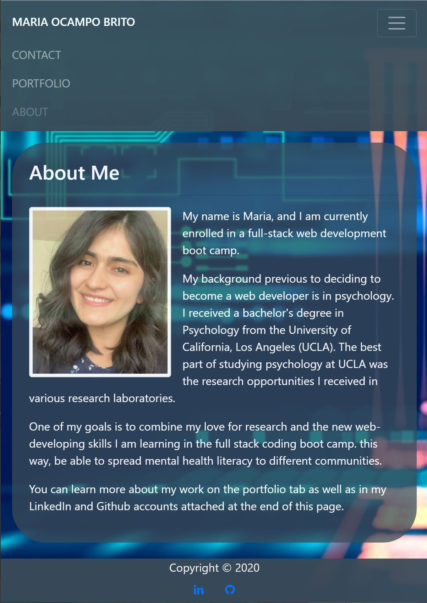

# Professional- Portafolio

This application is a connection to my personal information and work in software development. This way, it becomes easier for recruiters to learn more about me and my work. 

The responsive web application uses technologies such as HTML, CSS, bootstrap CSS framework and JQuery.

Visual Studio Code was used to work with all the technologies previously mentioned and be able to complete the application. The use of Bootstrap CSS was essential in developing the application since it provided the tools to create a responsive user interface. Once the code was completed, the application was published using Github Pages. 

When completing this application, some of the challenges that appeared included capturing the right dimensions of containers and images. Using bootstrap alone was not enough to successfully finish the responsive portfolio. I used styling CSS to fix arising dimension issues.  

## Deployed Application

 The link to the published application can be accessed on the following link:  
( https://ocampmaria.github.io/Personal-Portfolio/). 

This is a preview of how the Web application Looks Like: 

## No License
This file is for informational purposes only and follows the common naming convention of `LICENSE.md` to make it easy to find. No license is implied.

As explained by [choosealicense.com](https://choosealicense.com/no-permission/), when no license is declared: 

>[This repository] is under exclusive copyright by default. [You cannot] use, copy, distribute, or modify without being at risk of take-downs, shake-downs, or litigation.

- - -
Copyright &copy; Maria Ocampo. All Rights Reserved.

