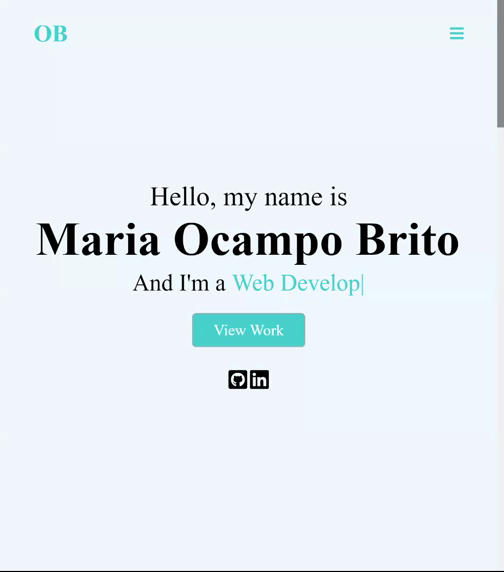

# Professional- Portafolio

## Table of Contents
  * [Description](#description)
  * [Deployed](#deployed)
  * [License](#license)
  * [Contributing](#contributing)

## Description

This application is a connection to my personal information and projects in software development. 
The responsive portfolio uses technologies such as HTML, CSS, Bootstrap CSS framework, and JQuery.

Visual Studio Code is used to work with all the technologies previously mentioned. 
Bootstrap CSS was essential in developing the application since it provided the tools to create a responsive user interface. Once the code was complete, the application was published using Github Pages.

Some of the challenges that appeared included capturing containers and images' correct dimensions when completing this application. Using bootstrap alone was not enough to successfully finish the responsive portfolio. I used styling CSS to fix arising dimension issues.

## Deployed
The link to the published application can be accessed on the following link:  
( https://ocampmaria.github.io/Personal-Portfolio/). 

## Preview: 

## License
Licensed under the MIT license.

## Contributing
To contribute to this README generator you can create a pull request or email me at mariaocampo0513@gmail.com for more questions.
  

- - -
Copyright &copy; 2020 Maria Ocampo. All Rights Reserved.
